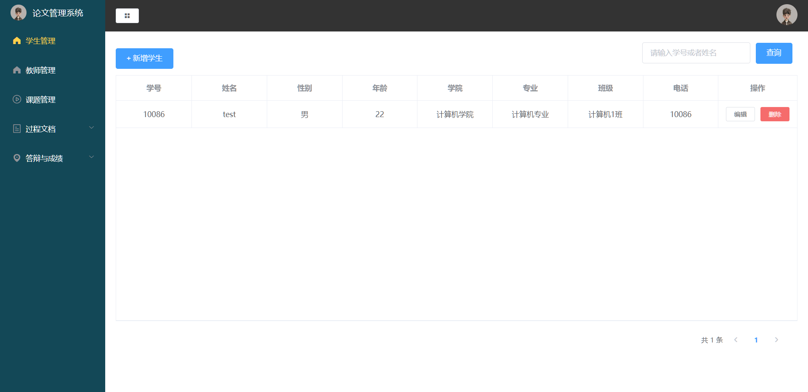
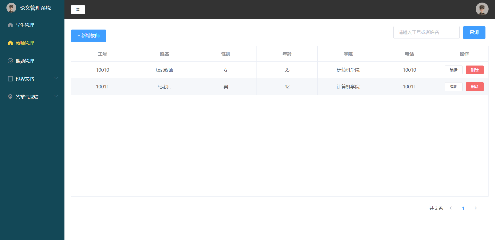
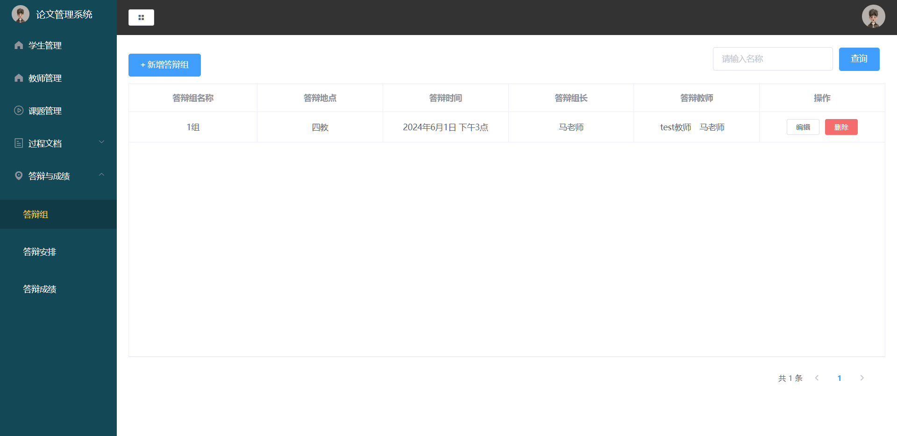
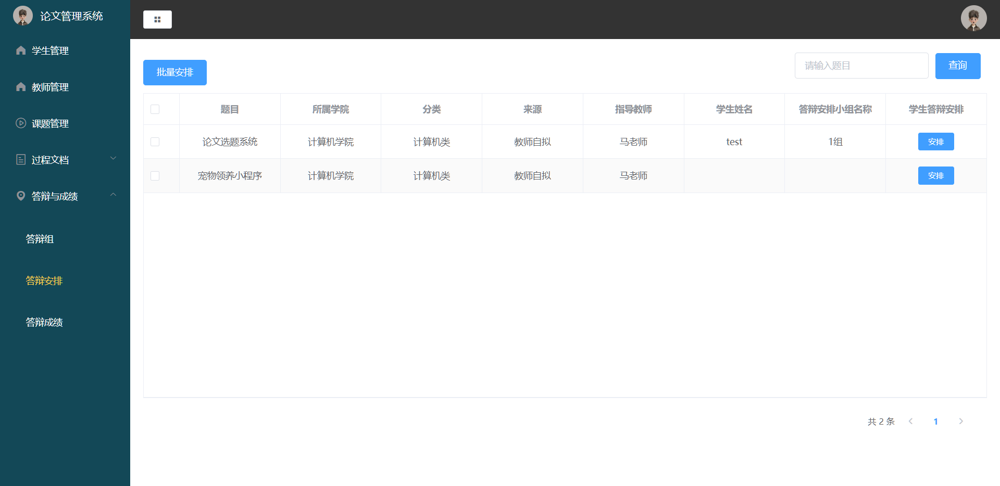
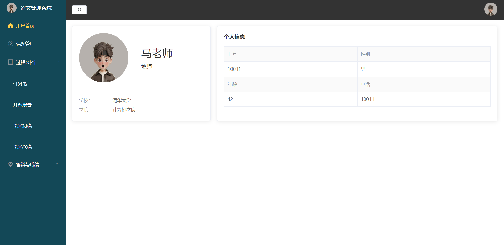
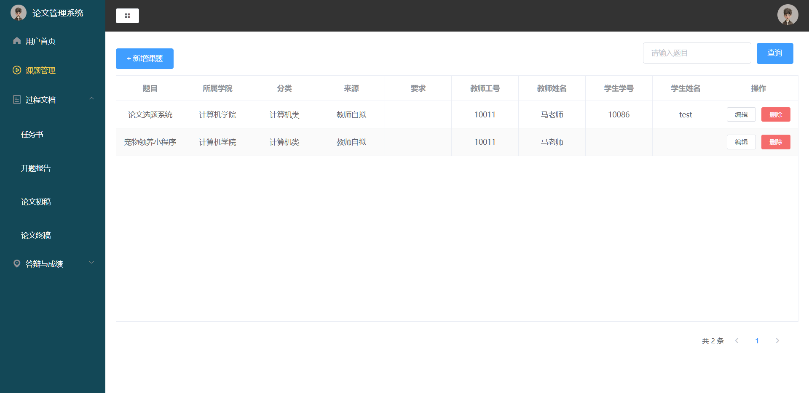
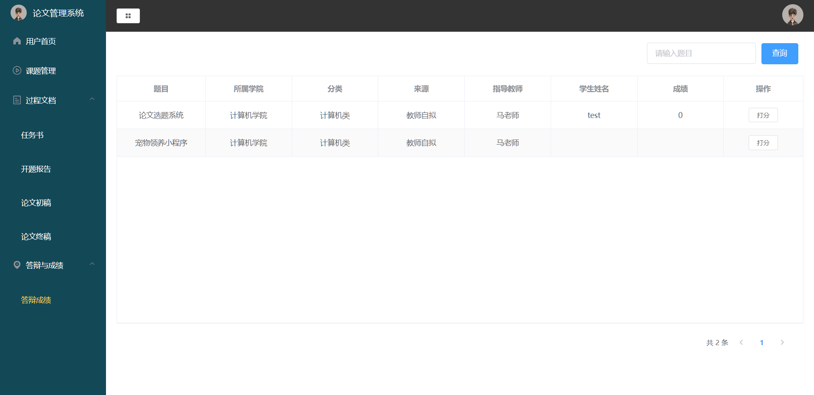
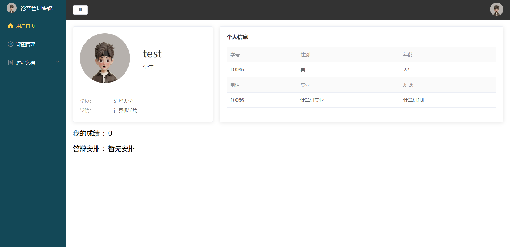
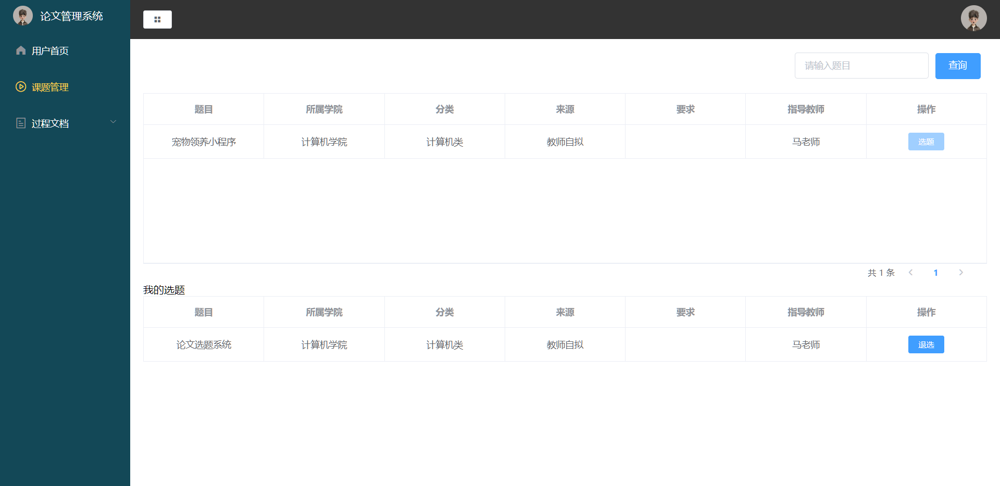
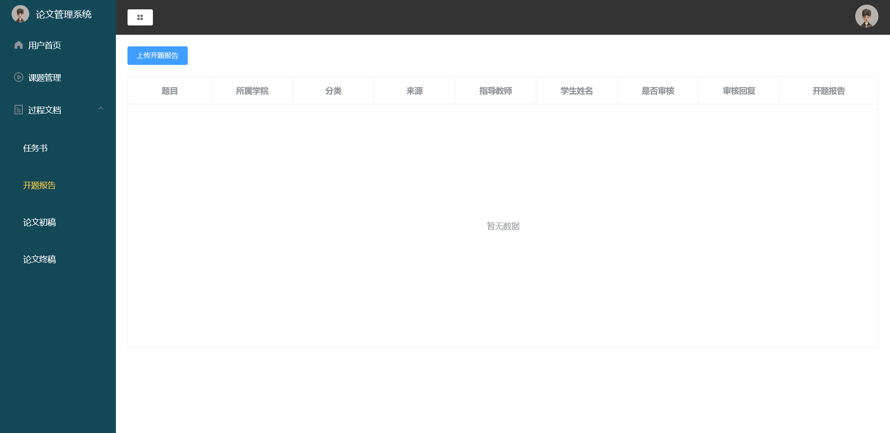

# 论文选题系统 论文管理系统 （个人独立编写，不是网上资源）
## 一、介绍（获取源码，[查看文章末尾](#四-咨询我们)） 
计算机毕业设计 论文选题系统 论文管理系统 ，前后端分离，分为三个个角色，管理员和教师和学生
 登录，选题，上传，答辩等功能

[点击我查看更多项目](https://www.yuque.com/rolling-k87y2/qrtzd0/gusuavwrtwe0ingz?singleDoc) 
## 二、技术栈
1. 前端：vue框架，微信原生小程序
2. 后端：nodejs express框架
3. 数据库：mysql

## 三、效果展示  

### 1. 管理员

### 2. 教师

### 3. 学生

## 四、🚀 咨询我们
1. **个人手敲，独立编写项目，不是网上所找的资源**
2. 提示该项目需要付费获取，编码不易，有需要或者疑问可加微信号：rolling_257
3. 扫一扫加我微信好友吧，请备注 论文管理系统源码获取

[点击我查看更多项目](https://www.yuque.com/rolling-k87y2/qrtzd0/gusuavwrtwe0ingz?singleDoc) 

